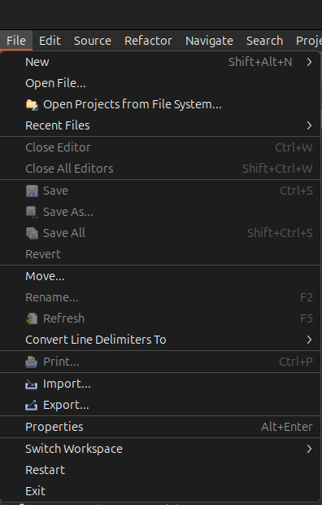

# Zalmotek RA4M1 Feather Blink

A simple LED blinking example for the Zalmotek RA4M1 Feather board, demonstrating basic GPIO control using Renesas RA4M1 microcontroller.

## Overview

This project demonstrates basic LED control on the Zalmotek RA4M1 Feather board, featuring the Renesas RA4M1 microcontroller. The example blinks the onboard LED connected to pin P400 (LED_BUILTIN) at a regular interval, showcasing fundamental GPIO configuration and timing control.

## Hardware Requirements

- Zalmotek RA4M1 Feather board
- USB Type-C cable for programming and power

## Software Requirements

- Renesas e² studio IDE
- RA4M1 FSP (Flexible Software Package)
- GCC ARM Embedded Toolchain

## Features

- Simple LED blinking demonstration
- Configurable blink interval
- Uses onboard LED (P400)
- Demonstrates basic GPIO configuration

## Code Functionality

The main application:
- Initializes the system clock and GPIO pins
- Configures P400 (LED_BUILTIN) as an output
- Implements a simple delay-based blinking pattern
- Toggles the LED state at regular intervals

## Getting Started

### Setup

1. Clone this repository
2. Open the project in e2 studio
   In e² studio go to File -> Import..., choose "Existing Projects into Workspace" and browse to the project you’ve just downloaded, then click Finish:
   
<p align="center">
  
  
</p>

After importing your project, open the configuration.xml file to access the board configurator. Let's review some key settings that will be relevant for all your future RA4M1 Feather SoM projects. First of all, in the BSP tab, your project should have the Custom User Board and the R7FA4M1AB3CFM device selected.

<p align="center">
  
</p>

Next, in the Pins tab, you may need to adjust this for future projects, based on what peripherals you want to enable. You can also set the pins as inputs or outputs and adjust their current drive capacity. For example, the LED is connected to P102 which is set to Output Mode. You can find its configuration in the Pin Selection menu ->Ports -> P1 -> P112.

<p align="center">
  
</p>

3. Connect your Zalmotek RA0E1 Feather board via USB
4. Build the project
5. Flash the firmware to the board

To run the project, click Generate Project Content, and then you can Build the project and Debug it. In the prompt that pops up, choose Debug as Renesas GDB Hardware Debugging. Click the Resume icon to begin executing the project. Reset the board and now the USR LED should be blinking.

If you want to access the J-Link RTT terminal for the SEGGER's J-Link RTT interface, you must download the RTT Viewer (link: https://www.segger.com/downloads/jlink/). For that, open the application and configure it according to the model below.

<p align="center">
  
  
</p>


### Configuration

```c
// LED configuration
#define LED_PIN    BSP_IO_PORT_04_PIN_00  // P400
#define LED_ON     BSP_IO_LEVEL_HIGH
#define LED_OFF    BSP_IO_LEVEL_LOW

// Blink timing configuration
#define BLINK_DELAY_MS 500
```

## Project Structure

- `src/`: Contains the main application source files
- `ra/`: Contains Renesas FSP configuration files
- `ra_gen/`: Contains generated FSP code
- `script/`: Contains build and flash scripts

## License

This project is licensed under the MIT License.

## Additional Resources

- [Zalmotek Website](https://zalmotek.com)
- [Zalmotek RA4M1 Website](https://zalmotek.com/products/RA4M1-Feather-SoM/)
- [SEGGER RTT Documentation](https://www.segger.com/products/debug-probes/j-link/technology/about-real-time-transfer/) 
